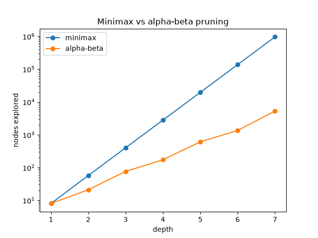

# Connect Four AI

A Connect Four engine using minimax with alpha-beta pruning, with benchmarks measuring what the pruning saves.



## Benchmark

Both modes search an empty board to the given depth and return the same move. Only the work differs.

| Depth | Minimax nodes | Alpha-beta nodes | Minimax time | Alpha-beta time |
|------:|--------------:|-----------------:|-------------:|----------------:|
| 1 | 8 | 8 | 0.001s | 0.001s |
| 2 | 57 | 21 | 0.008s | 0.003s |
| 3 | 400 | 76 | 0.056s | 0.010s |
| 4 | 2,801 | 173 | 0.409s | 0.023s |
| 5 | 19,608 | 606 | 2.92s | 0.084s |
| 6 | 137,257 | 1,353 | 20.5s | 0.182s |
| 7 | 960,793 | 5,270 | 181s | 0.676s |

At depth 7, pruning explores 182× fewer nodes and runs 268× faster. The effective branching factor drops from 7.0 to 3.9; the theoretical floor with perfect move ordering is √7 ≈ 2.65. The time speedup exceeds the node speedup because pruning cuts disproportionately into leaf nodes, which are the ones that run a full evaluation.

Reproduce with `python -m connect4.benchmark`.

## Install and play

```bash
python -m venv .venv
.venv/Scripts/python.exe -m pip install -e ".[dev]"   # Windows
# source .venv/bin/activate && pip install -e ".[dev]"  # macOS / Linux
connect4
```

Windows users can also double-click `play.bat`, which skips activating the virtualenv.

```
You played column 2 · AI played column 3 — 758 nodes in 0.10s
┌───┬───┬───┬───┬───┬───┬───┐
│ · │ · │ · │ · │ · │ · │ · │
│ · │ · │ · │ · │ · │ · │ · │
│ · │ · │ · │ · │ · │ · │ · │
│ · │ · │ · │ ○ │ · │ · │ · │
│ · │ · │ · │ ○ │ · │ · │ · │
│ ● │ ● │ ○ │ ● │ · │ · │ · │
│ 1 │ 2 │ 3 │ 4 │ 5 │ 6 │ 7 │
└───┴───┴───┴───┴───┴───┴───┘
```

The status line reports the AI's search cost per move. In this position it blocked at column 3 rather than extending its own column 4 — the defensive weighting described below.

| Flag | Default | Effect |
|------|---------|--------|
| `--depth` | 5 | Plies to search ahead |
| `--no-first` | off | AI moves first |
| `--no-alpha-beta` | off | Disable pruning |

## Implementation

**Search.** `search()` is minimax with alpha-beta pruning behind a flag. Pruning abandons a branch once the parent already has a better option, since nothing left in that branch can change the parent's choice. Both modes share one recursive function so the benchmark compares identical searches rather than two implementations.

**Evaluation.** Positions that exceed the search depth are scored by sliding a 4-cell window over every possible line and rewarding lines one side could still complete. The 69 lines on a 6×7 board are fixed geometry, so their flat indices are computed once at import; scoring is then a single NumPy fancy-index over the flattened grid rather than a Python loop. A window's score depends only on the piece counts it holds, not their positions, so the heuristic reduces to a cached 5×5 lookup table built from a scalar reference function.

**Weights** are asymmetric by default: an opponent's three-in-a-row scores −8 against +5 for our own, so the engine blocks rather than races. Evaluation is therefore not antisymmetric between players; a test asserts this deliberately.

## Tests

41 tests, run with `pytest`. Notable ones:

- Pruned and unpruned searches must return the same score across several depths — a wrong cutoff still returns a move, just occasionally the wrong one.
- The vectorised evaluation is cross-checked against a naive Python loop, since incorrect indexing fails silently.
- A full search must leave the board unchanged, because the search mutates and undoes moves rather than copying the board.

## Layout

```
src/connect4/
    board.py       grid, gravity, win detection
    ai.py          evaluation heuristic, minimax, alpha-beta
    benchmark.py   node/time measurements, generates the plot
    cli.py         terminal game
tests/
```

Python 3.10+. Depends on NumPy, matplotlib, and Typer.
